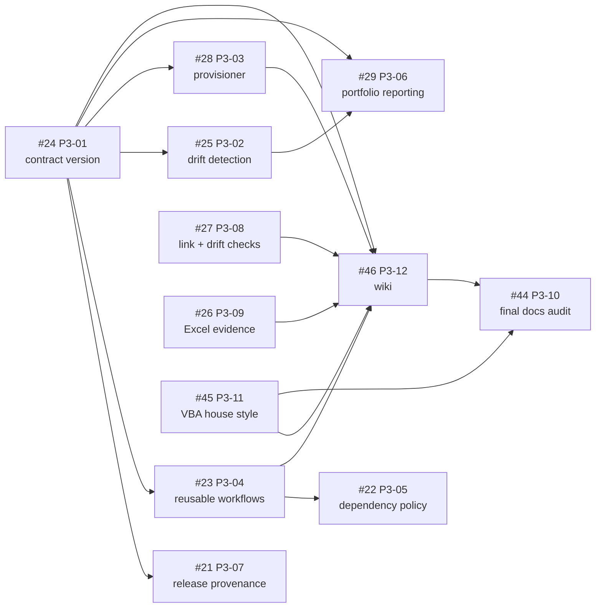

# 🗺️ v1.2.0 Implementation Plan

**Milestone:** v1.2.0 · **Branch:** `release/1.2.0` · **Baseline:** v1.1.0 at
`502a3836bec0eff888194f61ad5a7ba4701bf102`

**Plan revision:** 2 — scope decisions resolved; #24 in progress

> **Temporary execution document.** Delete it once the v1.2.0 definition of done
> is satisfied, as its v1.1.0 predecessor was. Durable contracts live in the
> documents named in [the authority map](README.md#authority-map); issue scope,
> acceptance criteria and closure evidence live in the issues themselves.

---

## 1. 🎯 What this document owns

This plan owns only what a single issue cannot express:

- the dependency graph and critical path across the milestone;
- the execution tiers and the one current next action;
- the milestone-level exit gate;
- open scope decisions that affect more than one issue.

It deliberately does **not** restate per-issue scope, acceptance criteria or
implementation evidence. Those belong to the issues, and duplicating them here
creates a second source of truth that drifts.

That is not a hypothetical risk. The v1.1.0 plan carried full findings tables
alongside the issues; by revision 19 it still named P2-01 as the next action
after P2-01 through P2-07 had already shipped. Ordering is what was missing then
and what this document exists to keep correct now.

---

## 2. 📋 Milestone scope

Thirteen issues, all assigned to the `v1.2.0` milestone.

| Issue | Item | Theme |
| --- | --- | --- |
| [#24](https://github.com/danielep71/EXCEL-VBA-PROJECT-TEMPLATE/issues/24) | P3-01 — Version the template contract independently | Contract |
| [#25](https://github.com/danielep71/EXCEL-VBA-PROJECT-TEMPLATE/issues/25) | P3-02 — Build semantic portfolio drift detection | Portfolio |
| [#28](https://github.com/danielep71/EXCEL-VBA-PROJECT-TEMPLATE/issues/28) | P3-03 — Add a dry-run-first repository provisioner | Portfolio |
| [#23](https://github.com/danielep71/EXCEL-VBA-PROJECT-TEMPLATE/issues/23) | P3-04 — Publish versioned reusable workflows | Distribution |
| [#22](https://github.com/danielep71/EXCEL-VBA-PROJECT-TEMPLATE/issues/22) | P3-05 — Add controlled dependency-update policy | Supply chain |
| [#29](https://github.com/danielep71/EXCEL-VBA-PROJECT-TEMPLATE/issues/29) | P3-06 — Publish portfolio quality and conformance reporting | Portfolio |
| [#21](https://github.com/danielep71/EXCEL-VBA-PROJECT-TEMPLATE/issues/21) | P3-07 — Add profile-aware advanced release provenance | Release |
| [#27](https://github.com/danielep71/EXCEL-VBA-PROJECT-TEMPLATE/issues/27) | P3-08 — Check external links and documentation drift separately | Assurance |
| [#26](https://github.com/danielep71/EXCEL-VBA-PROJECT-TEMPLATE/issues/26) | P3-09 — Add an optional Windows and Excel evidence pattern | Assurance |
| [#44](https://github.com/danielep71/EXCEL-VBA-PROJECT-TEMPLATE/issues/44) | P3-10 — Re-audit and polish the Markdown documentation suite | Documentation |
| [#45](https://github.com/danielep71/EXCEL-VBA-PROJECT-TEMPLATE/issues/45) | P3-11 — Apply the VBA house style to every starter module | Source |
| [#46](https://github.com/danielep71/EXCEL-VBA-PROJECT-TEMPLATE/issues/46) | P3-12 — Publish the creation and file-reference wiki | Documentation |
| [#47](https://github.com/danielep71/EXCEL-VBA-PROJECT-TEMPLATE/issues/47) | P3-13 — Consolidate focused-gate CLI orchestration | Tooling |

Completed on this branch: [#48](https://github.com/danielep71/EXCEL-VBA-PROJECT-TEMPLATE/issues/48)
(baseline integration of the #43 fixes) and
[#47](https://github.com/danielep71/EXCEL-VBA-PROJECT-TEMPLATE/issues/47).

---

## 3. 🔗 Dependency graph

Every edge below is taken from the **Dependencies** or **Sequencing** section of
the issue itself, not inferred.

**#24 is the dependency root.** It blocks four issues directly and two more
transitively. Nothing in the portfolio, distribution or provenance themes can be
certified against an unversioned policy snapshot, so starting anywhere else in
those themes produces work that has to be revisited.

---

## 4. 🧭 Execution tiers

| Tier | Issues | Condition |
| ---: | --- | --- |
| 0 | #48, #47 | Complete on `release/1.2.0` |
| 1 | **#24 — in progress**, #26, #27, #45 | Actionable now; no P3 prerequisite |
| 2 | #21, #23, #25, #28 | Requires #24 |
| 3 | #22, #29 | Requires #23 / requires #24 + #25 |
| 4 | #46, then #44 | Requires the interfaces above to be stable |

Tier 1 can run in parallel: #26, #27 and #45 touch assurance, link policy and
VBA source respectively, and none of them contends with #24.

#44 is last by construction — it is the final factual and cross-link
reconciliation, and running it before the other issues land guarantees a rerun.

## 5. ➡️ Immediate next action

**Begin [#24](https://github.com/danielep71/EXCEL-VBA-PROJECT-TEMPLATE/issues/24)
— P3-01, template contract versioning.**

First implementation step: define the SemVer policy for the template contract
and add the machine-readable contract-version field to
`.github/repository-profile.json`, keeping it independent from the generated
project's `VERSION`. Every later tier-2 and tier-3 issue consumes that field.

---

## 6. 🏁 Milestone exit gate

v1.2.0 is ready to release only when all of the following hold:

- [ ] Every issue in section 2 is closed with implementation evidence bound to an exact SHA and a green hosted run.
- [ ] `Repository integrity` and `Checker development` pass on the final candidate.
- [ ] The initializer self-test passes for `application`, `library` and `ui-component`.
- [ ] `VERSION`, the dated changelog heading and the candidate tag agree under the release-semantics gate.
- [ ] Excel compile and regression evidence is captured for the exact candidate SHA.
- [ ] The external release-evidence bundle validates with zero findings.
- [ ] This plan is deleted and any durable decision it holds has been moved into a maintained document.

---

## 7. ⚖️ Open scope decisions

These affect more than one issue and are recorded here until resolved.

| ID | Decision | Resolution |
| --- | --- | --- |
| D-01 | Whether to ship a `1.1.1` patch for the four fixes merged by [#43](https://github.com/danielep71/EXCEL-VBA-PROJECT-TEMPLATE/pull/43). | **Resolved — no `1.1.1`.** The fixes ship with v1.2.0. Consumers of the published v1.1.0 release do not receive them until then; this is accepted. |
| D-02 | Whether v1.2.0 should carry all thirteen issues. | **Resolved — one release.** All thirteen issues remain in v1.2.0; the milestone is not split. |

Both decisions were taken by the maintainer on 2026-09-06. No decision is open.

---

## 8. 🛡️ Governance and evidence rules

Carried forward from the v1.1.0 milestone; these remain in force:

- all milestone development lands on `release/1.2.0`; `main` stays the certified
  v1.1.0 baseline until one final merge;
- close an issue only when its own acceptance criteria are demonstrably green,
  citing the exact commit SHA and hosted run ID;
- preserve stronger specialist controls; never weaken a gate to make the
  template generic;
- keep external actions immutably pinned and version-audited;
- keep untrusted and scheduled workflows read-only unless a separate trusted
  write path exists;
- when a fix lands on `main` during the milestone, forward-integrate it into
  `release/1.2.0` promptly rather than reconciling at merge time.

---

**Execution principle:** close findings only with exact evidence, keep the next
action unambiguous, and let the issues — not this document — own what each
change must prove.
